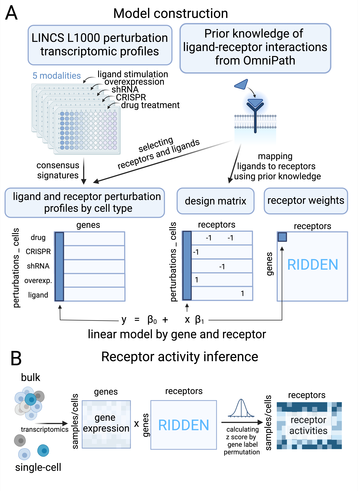

# RIDDEN: Data-driven inference of receptor activity for cell-cell communication studies
Using RIDDEN command-line tool receptor activities can be inferred from bulk and single-cell transcriptomic data.
This tool uniquely infers receptor activity based on the expression of receptor-regulated genes, rather than the traditional approach of focusing on the expression levels of ligands and receptors. 


The figure illustrates the construction of the model (A) and the method for inferring receptor activities (B).

The figure was created with BioRender.com.

The RIDDEN model matrix is available at `ridden_model/ridden_model_matrix.csv`.

To install the RIDDEN tool follow the instructions:

## Requirements
Before using the RIDDEN CLI, ensure that the following Python packages are installed in your environment:
- Python: version 3.9
- pandas: version 1.4.2
- numpy: version 1.22.3

## Installing environment using Anaconda
To set up your environment using Conda:
1. Install Anaconda or Miniconda: https://docs.anaconda.com/free/anaconda/install/index.html
2. Create a new Conda environment using yaml file : `conda env create -f environment.yaml `.
3. Activate your environment : `conda activate ridden_py39`.
4. Clone the GitHub repository to your local machine and navigate to the directory where you cloned the repository.
5. Install the RIDDEN CLI tool within the activated Conda environment.

## Installation
```sh
pip install .
```    
## Verify Installation
This command will display information about the installed ridden package
```sh
pip show ridden
```

## Usage
### Example
```sh
ridden-tool input_file.csv -n 100 -c 100 -o output_file
```

```sh
$ ridden-tool --help
```

```plaintext
usage: ridden-tool [-h] [-p NUMBER_OF_PERMUTATION] [-c CHUNK_SIZE] [-o OUTPUT_NAME] input

Run RIDDEN, the Data-driven inference of receptor activity for cell-cell communication studies

positional arguments:
  input                 Path to the input file. The input file format is csv and it contains gene symbols in columns and cells or samples in rows.

optional arguments:
  -h, --help            show this help message and exit
  -p NUMBER_OF_PERMUTATION, --number-of-permutation NUMBER_OF_PERMUTATION
                        Number of permutations (default: 100)
  -c CHUNK_SIZE, --chunk-size CHUNK_SIZE
                        Size of data processing chunks (default: 100)
  -o OUTPUT_NAME, --output-name OUTPUT_NAME
                        Name for the output file (default: output). The output file format is csv.
```

